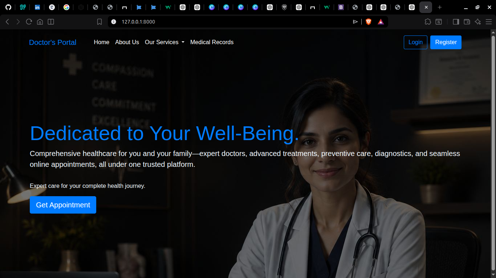

# 🩺 Doctor's Portal

A modern **Doctor Portal Web Application** built with **Django, HTML, CSS, JavaScript, and Bootstrap**. This project is being developed as an internship project with a focus on clean UI/UX and scalable architecture.

## 📸 Homepage Preview




---

## ✨ Features

- Responsive landing page
- Modern Hero section
- Patient Registration & Login
- Doctor Registration & Login
- Appointment Booking
- Medical Records
- Patient Dashboard
- Doctor Dashboard
- Admin Panel
- Responsive Bootstrap UI

---

## 🛠 Tech Stack

- **Frontend:** HTML5, CSS3, JavaScript, Bootstrap 4.6
- **Backend:** Python, Django
- **Database:** SQLite (Development)

---

## 📁 Project Structure

```text
doctor-portal/
│
├── config/
├── home/
├── accounts/
├── doctor/
├── patient/
├── appointments/
├── medical_records/
├── static/
├── templates/
├── manage.py
├── requirements.txt
└── README.md
```

## 🚀 Getting Started

```bash
git clone https://github.com/aman-ranjan-1/doctor-portal-django.git
cd doctor-portal-django

python -m venv .venv

source .venv/bin/activate     # Linux/macOS
# .venv\Scripts\activate      # Windows

pip install -r requirements.txt

python manage.py migrate

python manage.py runserver
```

Open:

```
http://127.0.0.1:8000/
```

## 📌 Project Status

Currently under active development.

### Planned Modules

- Public Website
- Authentication
- Patient Dashboard
- Doctor Dashboard
- Appointment Management
- Medical Records
- Admin Dashboard

---

## 👨‍💻 Developer

**Aman Ranjan**

GitHub: https://github.com/aman-ranjan-1

---
